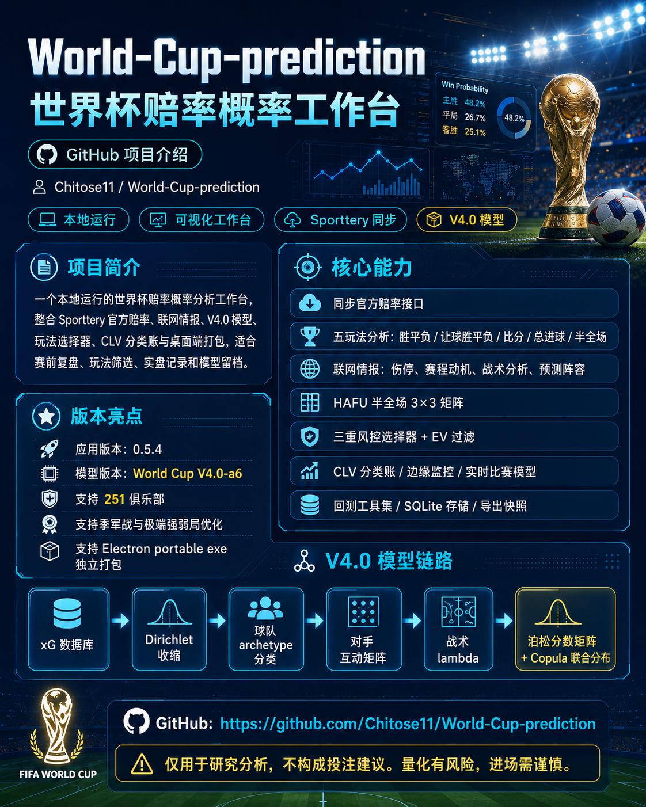
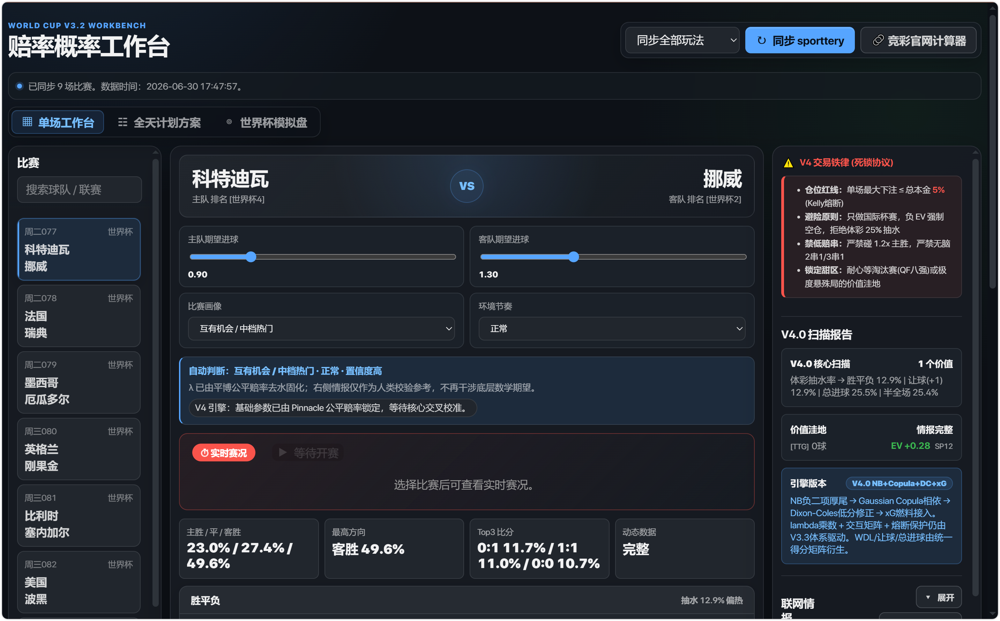
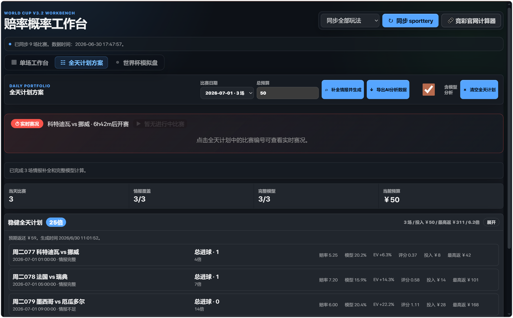
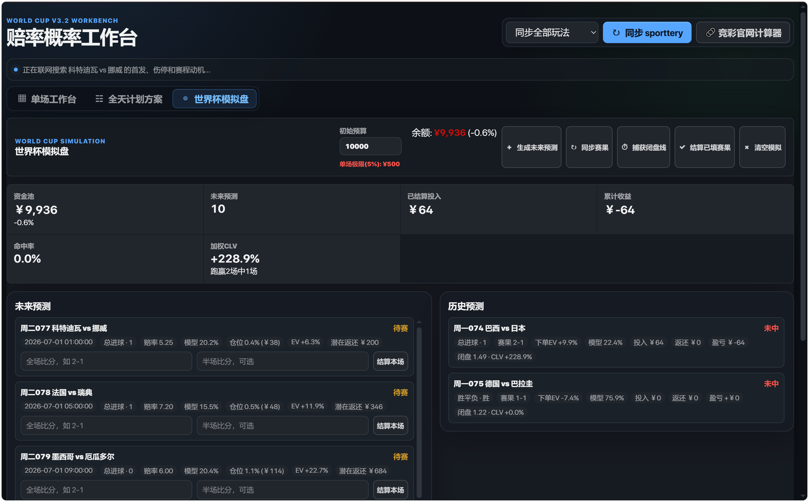
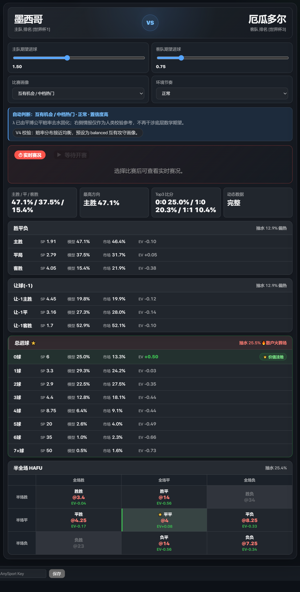

# World Cup V4.0 赔率概率工作台



这是一个本地运行的世界杯赔率概率分析工作台。项目把 sporttery 官方赔率、联网情报、V4.0 模型、玩法选择器、CLV 分类账和桌面端打包整合到一个可视化界面里，便于做赛前复盘、玩法筛选、实盘记录和模型留档。

> ⚠️ 数据和模型结果仅用于研究分析，不构成投注建议。量化有风险，进场需谨慎。

## 当前版本

- 应用版本：`0.5.4`
- 模型版本：`World Cup V4.0-a6` (xG 数据库驱动 + Copula 联合分布 + 251 俱乐部支持 + 季军战 + 极端强弱局优化 + HAFU 半全场矩阵)
- 核心变化：联网情报全面升级——伤停/赛程动机/战术分析三类查询改用 sporttery 官方 bssj 数据源；模型重大修复——季军战大球趋势优化、极端强弱局 LowBlock 熔断机制、四届世界杯完整回测验证；UI 升级——HAFU 半全场 3x3 矩阵、交易铁则驾驶舱、赛制全自动推断、导出功能增强。

## 核心功能截图

| 单场工作台 | 全天计划方案 |
|------------|------------|
|  |  |

| 世界杯模拟盘 | 比赛详情与 HAFU 矩阵 |
|-------------|-------------------|
|  |  |

## 核心能力

- 同步 sporttery 官方足球计算器赔率接口。
- 展示胜平负、让球胜平负、比分、总进球、半全场等玩法的隐含概率、模型概率、差值和风险。
- 联网搜索首发/预测阵容、赛程动机、出线形势和盘口异动（支持 Tavily Search 回退机制）。
- **bssj 官方数据优先**：以下三类信息优先从 sporttery 官方 bssj 接口获取结构化数据，不可用时自动回退联网搜索：
  - **伤停/停赛**：`getInjurySuspensionV1` — 球员姓名、号码、位置、伤病/停赛标志、出场统计
  - **赛程动机/积分榜**：`getMatchTablesV1` + `getFutureMatchesV1` — 小组排名积分、未来赛程密集度
  - **战术分析/近况**：`getMatchFeatureV1` + `getMatchResultV1` + `getResultHistoryV1` — 近10场战况、场均进球/失球、近期比分、历史交锋
  - **首发阵容**：`getMatchPlayerV1` — 射手/助攻排行作为补充，仍保留联网搜索获取完整预测阵容
- **HAFU 半全场 3x3 矩阵**：9个选项EV扫描，智能高亮肥尾机会(hh/aa/dh+EV>1.05红色边框)、甜区(quarter或gap>0.60金色边框)
- 自动把联网情报映射为模型输入，并刷新完整 V4.0 模型输出。
- **三重风控选择器**：按模型方向、赔率差值、比分矩阵、让球一致性筛选候选项；结合 `EV / (Odds - 1)` 的分母惩罚自然粉碎长尾陷阱；配置了 `2.2倍偏离度熔断` 防止 EV 幻觉。
- **交易铁则驾驶舱**：顶部红色警告面板展示4条铁则，5%仓位动态联动，maxBet>2500自动红色警告
- **CLV 分类账 (Closed-Loop Value)**：实时记录投注、自动捕获收盘赔率、计算 CLV 指标、支持 T-10 快照回退机制。
- **边缘监控系统**：每分钟扫描赔率异动，自动检测边缘波动并在终端告警。
- **实时比赛模型**：支持分钟级动态泊松模型，可根据当前比分和时间动态更新概率。
- **Copula 联合分布**：支持主队/客队进球的联合概率分布建模，更准确地刻画相关性。
- **全链路回测工具集**：提供多种回测场景支持，包括世界杯、俱乐部赛事等。
- **历史数据 SQLite 存储**：支持赔率数据的持久化存储和历史分析。
- **全日玩法计划**：区分稳健/进取模式，自动生成当日多场比赛组合方案。
- **导出功能增强**：
  - 可选是否包含模型分析数据（exportMode: "full" | "odds-only"）
  - 全天计划导出包含五玩法（had/hhad/ttg/hafu/crs）的 edge/EV/分类标签/赛制
  - 输出结构对齐 v33-r6 JSON：pools(原始赔率) + plays(合并分析) + v4model(完整引擎)
- **赛制全自动推断**：inferMatchStage() 自动识别，删除手动 stageSelect 下拉框，增加 API 洞察探测
- 支持整体模型快照导入/导出，支持 Electron portable exe 独立打包。

## V4.0 模型概要

V4.0 是基于真实 xG 数据的最严谨版本。它的核心链路：

```text
xG 数据库 (2018+2022 StatsBomb/FBref)
  → Dirichlet 伪计数收缩
  → 球队 archetype 分类
  → 对手互动矩阵 (6×6 archetype 矩阵)
  → 战术 lambda 乘数
  → 泊松分数矩阵 + Copula 联合分布
  → 经验校准 (Brier 0.198, ECE 3.2pp)
  → 玩法特定微调 (HT/FT, Handicap, TTG, HAFU)
```

**V4.0 关键特性**：

- **xG 数据库驱动**：整合 2018+2022 世界杯真实 xG 数据，30/70 权重混合，使用 Dirichlet 伪计数收缩避免小样本过拟合。
- **251+ 俱乐部球队支持**：集成 clubelo.com 数据，支持主流联赛俱乐部球队分析。
- **对手互动矩阵**：完全重写的 6×6 archetype 矩阵，S-finisher/high-depth/unstable-low-block/athletic-resistance/tactical-resistance/mid-tier 六大类别双向互动。
- **Lambda 乘数架构**：所有调整都作用于底层泊松参数，保证胜平负/让球/总进球/半全场的数学一致性。
- **Copula 联合分布**：建模主客队进球的相关性，提供更准确的联合概率估计。
- **经验校准层**：基于 212 场历史预测的校准 bins，修正模型系统性偏差。
- **比赛阶段分层**：小组赛/32强/16强/八强/四强/决赛分别应用不同的保守系数和 surge 系数。
- **小组第三轮动机**：专为 2026 世界杯 48 队赛制设计的动机修正器。
- **季军战大球优化**：Third Place 专属调优，禁用 Dixon-Coles 低分修正、强制开放节奏、点球尺度调整。
- **极端强弱局熔断**：favWinGap > 60pp 时触发，unstable-low-block 战术性修正，85pp+弱队完全归零。
- **实时比赛模型**：支持分钟级动态更新，时间衰减 + 伤停补时尾端增强。

## 运行与部署

安装依赖：
```powershell
npm install
```

启动本地服务：
```powershell
npm start
```
> 打开浏览器访问：`http://localhost:4173`
> Windows 用户亦可直接双击 `start-workbench.cmd`

### Tavily API 配置

后端仅从本机读取密钥，不会向前端暴露。任选以下一种方式：
```powershell
# 方式一：环境变量注入
$env:TAVILY_API_KEY="your-tavily-api-key"
npm start
```
或保存到秘钥文件（推荐）：
`%USERPROFILE%\.codex\secrets\tavily_api_key.txt`

### AnySport API 配置（可选）

用于实时比赛数据：
```powershell
$env:ANYSPORT_API_KEY="your-anysport-api-key"
```

### bssj 官方数据 API

项目提供两个层级的 bssj 数据访问：

**单项查询** `GET /api/sporttery-injury?mid={sportteryMatchId}` — 仅返回伤停数据

**全量查询** `GET /api/sporttery-bssj?mid={sportteryMatchId}` — 并行抓取全部6个API：
- `getMatchFeatureV1` — 特征分析（近10场战况、场均进球失球）
- `getMatchTablesV1` — 积分榜（小组排名、胜平负、积分）
- `getMatchPlayerV1` — 射手信息（进球、助攻、出场统计）
- `getResultHistoryV1` — 历史交锋统计
- `getMatchResultV1` — 比赛近况（近期比分、胜负）
- `getFutureMatchesV1` — 未来赛事（赛程密集度/轮换风险）

示例：
```powershell
curl "http://localhost:4173/api/sporttery-bssj?mid=2040292"
```

## 桌面版打包

```powershell
npm run dist
```
产物默认输出到：`dist\World Cup V3.2 Workbench-0.5.4-portable.exe`
> 桌面版启动时会分配随机本地端口，避免与已运行的 `4173` 冲突。

## CLV 分类账使用

分类账自动保存在：`%APPDATA%\sporttery-v32-workbench\clv_ledger.json`

- **记录投注**：前端选择比赛和玩法后自动记录
- **收盘赔率捕获**：Auto Monitor 在 T-5 分钟自动捕获收盘赔率
- **T-10 快照回退**：如果未捕获到收盘赔率，使用 T-10 快照回退
- **CLV 计算**：`CLV = (taken_odds / closing_odds - 1) * 100`
- **正负 CLV 统计**：自动计算平均 CLV 和正 CLV 比例

## 历史数据与回测

### SQLite 历史数据库

项目支持将赔率数据存储到 SQLite 数据库进行持久化分析：

```powershell
# 迁移历史数据到 SQLite
node scripts/migrate_to_sqlite.js

# 恢复历史数据
node scripts/recover_history.js

# 从 500.com 拉取历史让球赔率
python scripts/fetch_hhad_500.py
```

数据库文件位置：`sporttery_history.db`

### 回测工具集

项目提供了完整的回测工具链：

```powershell
# 基础选择器回测
node scripts/backtest-selector.js

# V2 选择器回测
node scripts/backtest-v2.js

# V4 完整回测
node scripts/backtest-v4.js

# 世界杯专项回测
node scripts/backtest-wc.js

# 四届世界杯完整回测
node scripts/backtest-wc-all.js

# 结果分析
node scripts/backtest-results.js

# 最终回测
node scripts/backtest-final.js

# 一键拉取 + 回测
node scripts/fetch-and-backtest.js

# V4 压力测试
node scripts/stress-test-v4.js
```

### Club ELO 数据

构建俱乐部 ELO 评级：
```powershell
python scripts/build_club_elo.py
```

## 复测与回溯验证

每次修改模型后，必须执行以下基准测试：
```powershell
# 语法与链路自检
node --check src/v4-engine.js
node --check public/app.js
python -m py_compile model/world-cup-v32/scripts/world_cup_v32_helpers.py

# 历史回测 JSON 快照对比
node scripts/backtest-v33-selector.js
```

## 项目结构

```text
src/                         后端服务、模型引擎、Electron 入口
  ├── v4-engine.js          V4.0 模型引擎（含 251+ 俱乐部支持、Copula、季军战优化、极端局熔断）
  ├── server.js             HTTP 服务器 + Auto Monitor + 采集状态 API + 伤停 bssj API
  ├── jingcai-ttg-scanner.js 玩法扫描器（含 HAFU 扫描）
  ├── anysport-service.js   AnySport 实时数据服务
  └── electron-main.js      Electron 桌面入口
public/                      前端页面、样式和交互逻辑（卡片式布局、HAFU 矩阵、交易铁则）
  ├── app.js                前端逻辑（含导出选项、HAFU 渲染、5%仓位联动）
  ├── index.html            界面（含铁则面板、导出复选框）
  └── styles.css            样式（含 hafu-matrix、hafu-cell-fat 等）
model/world-cup-v32/         Skill、模型规则文档、辅助脚本和参考数据
  ├── references/           V3.3/V4.0 详细文档
  └── scripts/              Python 辅助工具
scripts/                     回测和验证脚本
  ├── backtest-selector.js  选择器回测
  ├── backtest-v2.js        V2 回测
  ├── backtest-v4.js        V4 完整回测
  ├── backtest-wc.js        世界杯专项回测
  ├── backtest-wc-all.js    四届世界杯完整回测
  ├── backtest-wc2022-ko.js 2022 韩国比赛回测
  ├── backtest-results.js   结果分析
  ├── backtest-final.js     最终回测
  ├── fetch-and-backtest.js 一键拉取回测
  ├── stress-test-v4.js    V4 压力测试
  ├── migrate_to_sqlite.js  历史数据迁移到 SQLite
  ├── recover_history.js    历史数据恢复
  ├── fetch_hhad_500.py     500.com 历史让球赔率
  ├── build_club_elo.py     俱乐部 ELO 构建
  ├── phase2_calibrate.js   V4.0 Phase 2 校准
  ├── phase2_wc_backtest.js V4.0 Phase 2 世界杯回测
  ├── phase3_backtest.js    V4.0 Phase 3 完整回测
  ├── phase3_jingcai.js     V4.0 Phase 3 竞彩集成
  └── selector-v2.js        V2 选择器
docs/                        项目文档与截图
  ├── project-overview.png  项目整体介绍图
  ├── screenshot-1-main.png 单场工作台截图
  ├── screenshot-2-daily.png 全天计划方案截图
  ├── screenshot-3-simulation.png 世界杯模拟盘截图
  └── screenshot-4-match.png 比赛详情与 HAFU 矩阵截图
outputs/                     (自动生成) 本地输出日志，勿提交
dist/                        (自动生成) 打包产物，勿提交
```

## 更新日志

### 0.5.4 (2026-06-30) - HAFU 半全场矩阵 + 交易铁则驾驶舱 + 导出增强 + 赛制自动推断
- **HAFU 半全场 3x3 矩阵**：3x3网格展示半场×全场结果，每格显示赔率@odds + EV值，智能高亮肥尾机会(hh/aa/dh+EV>1.05红色边框)、甜区(quarter或gap>0.60金色边框)
- **交易铁则驾驶舱**：顶部红色警告面板展示4条铁则，simBankrollInput旁动态显示单场5%仓位上限，maxBet>2500自动红色警告
- **导出功能增强**：
  - 新增"含模型分析"复选框（默认勾选）
  - 取消勾选时仅导出pools(原始赔率)，跳过所有模型计算
  - 全天计划导出包含五玩法（had/hhad/ttg/hafu/crs）的 edge/EV/分类标签/赛制
  - 输出结构对齐 v33-r6 JSON：pools(原始赔率) + plays(合并分析) + v4model(完整引擎)
  - 文件名区分：v4-analysis-*.json | v4-odds-*.json
- **赛制全自动推断**：inferMatchStage() 自动识别，删除手动 stageSelect 下拉框，增加 API 洞察探测 console.log
- **HAFU 矩阵修复**：合并为单一 hafu-grid 容器，16个节点严格按DOM顺序排列，列宽原子级对齐，修复列偏移错位问题

### 0.5.3 (2026-06-29) - 季军战 + 极端强弱局熔断 + 四届世界杯完整回测
- **季军战大球优化 (Third Place)**：禁用 Dixon-Coles 低分修正 (dcRho=0)、强制开放节奏 (tempo=open)、点球尺度调整 (penaltyScale=0.30)
- **极端强弱局熔断机制 (favWinGap > 60pp)**：unstable-low-block 战术性修正，85pp+弱队归零，反杀美式防守、防止强队弱防被爆冷
- **Dixon-Coles 覆盖范围扩展**：覆盖所有非小组赛（16强+）
- **四届世界杯完整回测**：2010/2014/2018/2022 48场杯赛验证
- **回测结果**：
  - 2022世界杯 ROI: -9.5% (原-14.6%，提升+5.1pp)
  - 2014世界杯 ROI: +192.6%
  - 2010世界杯 ROI: +119.6%
  - 核心信号验证：HAFU 四届全正、TTG 四届全负（方向正确）、八强连续三届开正（8强是甜区）
- **新增脚本**：`backtest-wc-all.js`、`backtest-wc2022-ko.js`、`stress-test-v4.js`

### 0.5.2 (2026-06-25) - 联网情报 bssj 全面接入
- **赛程动机改用官方数据**：`getMatchTablesV1`（积分榜）+ `getFutureMatchesV1`（未来赛事），自动输出小组排名、积分、未来赛程密集度
- **战术分析改用官方数据**：`getMatchFeatureV1`（特征分析）+ `getMatchResultV1`（比赛近况）+ `getResultHistoryV1`（历史交锋），自动输出近10场战况、场均进球/失球、近期比分
- **首发阵容补充射手数据**：`getMatchPlayerV1` 提供进球/助攻排行作为补充，仍保留联网搜索获取完整预测阵容
- **新增 `/api/sporttery-bssj` 端点**：一次性并行抓取全部6个 bssj API
- **盘口异动保留联网搜索**：该类别无对应 bssj API

### 0.5.1 (2026-06-25) - 伤停数据源切换
- **伤停信息改为官方来源**：优先从 sporttery 官方 bssj API (`getInjurySuspensionV1.qry`) 直接获取伤停/停赛数据
- **新增 `/api/sporttery-injury` 端点**：独立提供结构化伤停数据查询
- **伤停数据格式化**：输出球员姓名、号码、位置、伤病/停赛标志、出场统计
- **自动回退机制**：sporttery API 不可用时自动回退到 Tavily/Bing 联网搜索

### 0.5.0 (2026-06-25) - V4.0 正式版发布
- **版本升级**：0.4.0 → 0.5.0
- **新增 Copula 联合分布**：支持主客队进球相关性建模
- **新增 251+ 俱乐部球队支持**：集成 clubelo.com 数据
- **前端重构**：卡片式扫描布局替代原表格布局，新增采集器状态栏
- **全链路回测工具集**：提供多种回测场景支持
- **历史数据 SQLite 存储**：支持数据持久化与历史分析
- **后端 API 扩展**：采集状态接口、竞彩官网计算器代理、自动缓存
- **新增 500.com 历史让球赔率**：Python 脚本拉取历史数据

### 0.4.0 (2026-06-24) - V4.0 大版本更新
- **新增 V4.0 引擎**：基于 2018+2022 xG 真实数据驱动
- **新增 CLV 分类账**：实盘记录 + 自动收盘捕获 + T-10 快照回退
- **新增边缘监控**：每分钟扫描赔率异动，终端告警
- **新增实时比赛模型**：分钟级动态泊松更新
- **新增经验校准层**：212 场历史预测校准 (Brier 0.198)
- **对手互动矩阵重写**：6×6 archetype 完整双向互动
- **球队重新分类**：physical-resistance 拆分为 athletic/tactical 两类
- **p0 平局先验优化**：0.27 → 0.24，n0 样本量 24 → 20
- **Electron 依赖升级**：v37.2.5 + electron-builder v26.0.12
- **废弃 V3.2 引擎**：完全迁移至 V4.0

### 0.3.0 (2026-06-22) - V3.3 r5/r6 迭代
- Lambda 乘数架构全面落地
- Danger Zone 从模型层移至选择器层
- 新增 A- 弱队对手修正器
- 平局先验进一步优化

### 0.2.6 (2026-06-18) - V3.3 r1/r4
- 初始 V3.3 覆盖层
- 经验校准引入
- 小组第三轮动机模型

## 发布守则
- 绝对禁止提交 `node_modules/`、`dist/`、`outputs/` 及任何包含本机 Key 的文件！
- 共享开源项目时只脱敏分享源码、模型文档和打分架构。
- 独立发行可将 `dist` 目录下的 portable exe 打包分发。
